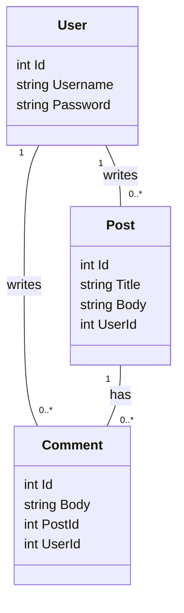

# DNP1 Forum

Forum-app i stil med Reddit, bygget gennem DNP1-afleveringerne (VIA, 3. semester).

## Assignment 1 - Entities and Repositories

### Domain model

Relationer er modelleret med fremmednøgler (`UserId`, `PostId`), ikke associationer.

### Projekter

| Projekt | Indhold | Afhænger af |
|---|---|---|
| `Server/Entities` | `User`, `Post`, `Comment` | - |
| `Server/RepositoryContracts` | `IUserRepository`, `IPostRepository`, `ICommentRepository` | Entities |
| `Server/InMemoryRepositories` | Implementeringer der gemmer i en `List` | Entities, RepositoryContracts |
